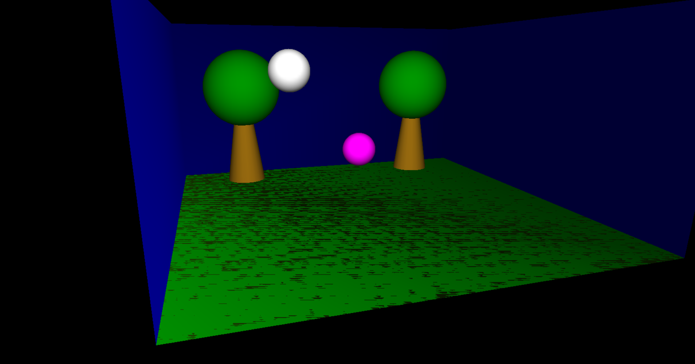

# Bouncing Ball Simulation

## Introduction
This repository hosts the code for a simple yet engaging Bouncing Ball simulation, which demonstrates the principles of physics and game development. 
The simulation is built using OpenGL and GLUT frameworks, providing a real-time rendering of a ball bouncing within a defined environment.

## Features
- Realistic bouncing effect using physics calculations.
- Adjustable parameters for gravity, elasticity, and surface friction.
- 3D camera controls to observe the simulation from different angles.

## Getting Started

### Prerequisites
Before running the simulation, ensure you have the following installed:
- C++ Compiler (GCC recommended)
- OpenGL
- GLUT

### Building and Running the Simulation
1. Clone the repository to your local machine:
```bash
git clone https://github.com/AndreeaDraghici/Bouncing-Balls-3D.git
```

2. Navigate to the project directory:
```bash
cd Bouncing-Balls-3D
```

3.Compile the code (example given for g++):
```bash
g++ -o Bouncing-Balls-3D Application.cpp Ball.cpp Camera.cpp Scene.cpp -lGL -lGLU -lglut
```

4.Run the simulation:
```bash
./Bouncing-Balls-3D
```

### Development Environment
The simulation was developed on a Windows 10 machine, using Visual Studio 2022, and is written in C++ for cross-platform compatibility. 
It uses the OpenGL library for rendering graphics and the GLUT framework for managing the GUI and handling input events.


